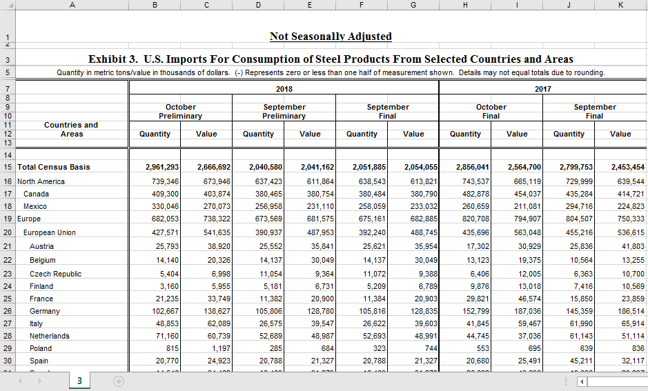
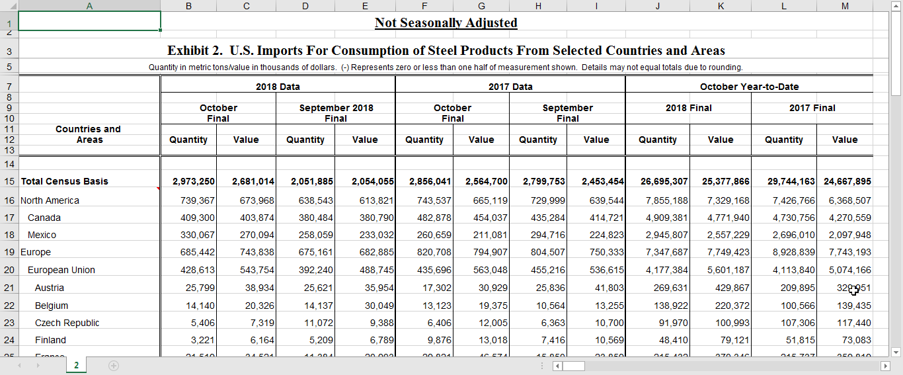
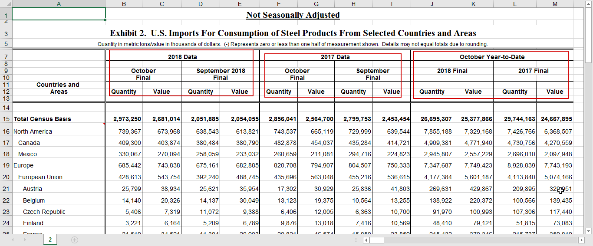

```{r setup, include=FALSE}
knitr::opts_chunk$set(echo = TRUE)
# Load the tidyverse
library(tidyverse)
library(readxl)
library(lubridate)
library(stringr)
library(data.table)
library(DT)
library(ggplot2)
```


## About Datasset  {.tabset .tabset-fade .tabset-pills}

There are several challenges of this untidy dataset:

1) multiple layers of headers: year -> month -> quantity/value

2) nonuniform values: some values are sums of other values


### Data 
In this process there are two file one is Priliminary and other is Final US IMport file 

*Prliminiary File before reading 


*Final File before reading 



### Funcation {.tabset .tabset-fade .tabset}

#### Read Header Function 

```{r}
# Function to Read Header from File 

  getHeader <-  function(phead,startFrom = 2) {  
    
                ytd <- FALSE
                phead <- phead[,startFrom :dim(phead)[2]]
                header<- character(dim(phead)[2])
                for (i in 1:dim(phead)[2]){
                  
                  if(!ytd){
                  # for (j in 1:dim(phead[i])[1]){
                  if(!is.na(phead[[i]][[1]])){
                     yr = str_extract(phead[[i]][[1]],"\\d{4}")   
                     
                  }
                  
                  if(!is.na(phead[[i]][[3]])){
                     mn <- str_extract(phead[[i]][[3]],"\\w+")
                  }
                  
                 
                  if(!is.na(phead[[i]][[4]])){
                    typ <- phead[[i]][[4]]
                  }
                  
                   if(!is.na(phead[[i]][[6]])){
                    ttyp <- phead[[i]][[6]]
                   }
                  }
                  ## Other Case mostly true for Final Dataset
                  if(is.na(yr) & str_detect(phead[[i]][[1]],"Year-to-Date")) {
                    ytd <- TRUE # set True to we know its Year to date column GROUP
                              yr=str_extract(phead[[i]][[3]],"\\d{4}")
                              mn <- paste0( str_extract(phead[[i]][[1]],"\\w+"),"-Year-to-Date") 
                              typ<-str_extract(phead[[i]][[3]],"[[:alpha:]]+")   
                            
                  }
                  
                  if(ytd){
                    
                    if(!is.na(phead[[i]][[3]])){
                     yr=str_extract(phead[[i]][[3]],"\\d{4}")
                      
                    }
                    
                        if(!is.na(phead[[i]][[1]])){
                        mn <- paste0( str_extract(phead[[i]][[1]],"\\w+"),"-Year-to-Date") 
                        }else{
                        
                        }
                    
                    if(!is.na(phead[[i]][[6]])){
                    ttyp <- phead[[i]][[6]]
                   }
                    
                  }
                  
                    # print(paste(i,j,yr,mn,typ,ttyp))
                    header[i] = paste(yr,mn,typ,ttyp)
                }
                return(header)
  }
                
```

#### Reading Prelimnary File Function 

```{r}
#--------------------------Preliminary Data -------------------------------

readPre <- function(fileName) {
# fileName = "steel1p.xls"
  # Get the total No of columns in file 
File1Length<- dim(read_xls(fileName,skip = 16,n_max=1))[2]

# Get the Header of the File and Give them Header so that we can use data and not loose it in header.
phead <- read_xls(fileName,n_max=14,col_names = character(File1Length))


  
from <- str_which(phead$X__2,"\\d{4}")
to <- from + 6
phead <- phead[from:to,]


# Buliding Header 
pheader<-c("Region", getHeader(phead))

#Load the Prilim data with the header
#pdata <- suppressWarnings(read_excel(fileName,skip = 15,col_names = pheader))

# There are some NA Columns and we don't need to load them so we will force to read only certain columns.using cell_cols(1:n)

pdata <- suppressWarnings(read_excel(fileName,skip = 15,col_names = pheader))
 # Getting rid of text with pattern "NOTE: and extra blank row at the end 
   
 pdata   <- pdata[1:(which(str_extract(pdata$Region,":")==":")-2),]   

 #------------------Alternate Method 
 # str_which(fdata$Region,":")

# Create a vector of "noncountry" values that appear in the region variable
noncountries <- c("North America", "South/Central America", "Antarctica", "Europe", "Eurasia","European Union","Pacific Rim Countries","Other Countries","Middle East", "Africa", "Asia & Oceania", "World","Euro Area")


# Look for matches
matches <- which(!is.na(match(pdata$Region, noncountries)))
# create a tibble of country values
pdata_country <- pdata[-matches,]

# Gathering data to make it Tidy 
# Split the Col into row so that we can use the data. by Year, Month, Type .
 gather_pdata2_2 <-pdata[-matches,]%>%
                    gather(key="COL NAMA","Data",-c("Region")) %>%
                    separate(., c("COL NAMA"), c("Year","Month","SampleType","DataType"), sep = " ", remove = TRUE)


# Remove SampleType = Final to avoid redundency
# Spread the data of DataType to their respective Value. 
pdata_p1<- filter(gather_pdata2_2,SampleType != c("Final")) %>%
  spread(DataType,Data)
return(pdata_p1)
  
}

#--------------------------Preliminary Data -------------------------------
```

#### Working with Final File

```{r}
# Working for Final data file

## Final Data
readFinal <- function(fileName) {
  
  File2Length<- dim(read_xls(fileName,skip = 16,n_max=1))[2]
# fhead <- read_xls(fileName,skip = 6,n_max=6,col_names = character(File2Length))
fhead <- read_xls(fileName,n_max=14,col_names = character(File2Length))
from <- str_which(fhead$X__2,"\\d{4}")
to <- from + 6
fhead <- fhead[from:to,]

# Buliding Header
fheader<-c("Region", getHeader(fhead))
  
  
  
#    File2Length<- dim(read_xls("steel2f.xls",skip = 16,n_max=1))[2]
# fhead <- read_xls(fileName,skip = 6,n_max=6,col_names = character(File2Length))
# 
# # Buliding Header 
# fheader<-c("Region", getHeader(fhead))

fdata <- suppressWarnings(read_excel(fileName,skip = 15,col_names = fheader)) 

 fdata <- fdata[1:(str_which(fdata$Region,":")-2),]
 
 # Create a vector of "noncountry" values that appear in the region variable
noncountries <- c("North America", "South/Central America", "Antarctica", "Europe", "Eurasia","European Union","Pacific Rim Countries","Other Countries","Middle East", "Africa", "Asia & Oceania", "World","Euro Area")


# Look for matches
matches <- which(!is.na(match(fdata$Region, noncountries)))

 # create a tibble of country values
fdata_country <- fdata[-matches,]

 gather_fdata2 <-fdata[-matches,]%>%
                    gather(key="COL NAMA","Data",-c("Region")) %>%
                    separate(., c("COL NAMA"), c("Year","Month","SampleType","DataType"), sep = " ", remove = TRUE) %>%
                    .[-str_which(.$Month,"\\w+-(?=Year-to-Date)"),]  %>%  ## Sort form for gather_fdata2[-str_which(gather_fdata2$Month,"\\w+-(?=Year-to-Date)"),]
                    spread(DataType,Data)        ## Moving DataType COlumn to Header
                  
 fdata_p1 <- gather_fdata2
 
 return( gather_fdata2)

  
}


 
# #------------------------------------------------
# 
# File2Length<- dim(read_xls("steel2f.xls",skip = 16,n_max=1))[2]
# # fhead <- read_xls("steel2f.xls",skip = 6,n_max=6,col_names = character(File2Length))
# fhead <- read_xls("steel2f.xls",n_max=14,col_names = character(File2Length))
# from <- str_which(fhead$X__2,"\\d{4}")
# to <- from +6
# fhead <- fhead[from:to,]
# 
# # Buliding Header
# fheader<-c("Region", getHeader(fhead))
# 
# #_------------------------------------------------
# 
# #------------------------------------------------
# 
# File2Length<- dim(read_xls("steel3f.xls",skip = 16,n_max=1))[2]
# fhead <- read_xls("steel3f.xls",skip = 6,n_max=6,col_names = character(File2Length))
# fhead <- read_xls("steel3f.xls",n_max=14,col_names = character(File2Length))
# 
# # Buliding Header
# fheader<-c("Region", getHeader(fhead))
# str_which(fhead$X__1,"Exhibit")
# 
# str_which(fhead$X__2,"\\d{4}")
# #_------------------------------------------------
```

### Read Prliminary file  {.tabset .tabset-fade .tabset}

* File before reading 

```{r}

# unzip("h1b_kaggle.csv.zip")


# Get the column Length of File , so that we can put some dummy name to column and read data including header as data row.
  File1Length <- dim(read_xls("steel3p.xls",skip = 16,n_max=1))[2]

# Read File by skipping 6 row and only reading next 6 row to build header.
phead <- read_xls("steel3p.xls",skip = 6,n_max=6,col_names = character(File1Length))


# Buliding Header by calling Function and passing. 
pheader<-c("Region", getHeader(phead))

# Set the column name for the read file , and read only data for rest of row. 
pdata <- suppressWarnings(read_excel("steel3p.xls",skip = 15,col_names = pheader))

# Preview Data 
datatable(phead)

pheader


#                 
#               c("Region","2018_October_Preliminary_Quantity","2018_October_Preliminary_Value",
#               "2018_September_Preliminary_Quantity","2018_September_Preliminary_Value",
#               "2018_September_Final_Quantity","2018_September_Final_Value",
#               "2017_October_Final_Quantity","2017_October_Final_Value",
#               "2017_September_Final_Quantity","2017_September_Final_Value")   
#                 


                
```

#### Header 
```{r}
# Preview Data 
datatable(phead)
```


#### Final Header

```{r}
pheader
```

#### Preview Final Data

```{r}

datatable(pdata)
```

#### Data Wrangling  {.tabset .tabset-fade .tabset-pills}


```{r}
                


 # pheader <- c("Region","2018_October_Preliminary_Quantity","2018_October_Preliminary_Value",
 #              "2018_September_Preliminary_Quantity","2018_September_Preliminary_Value",
 #              "2018_September_Final_Quantity","2018_September_Final_Value",
 #              "2017_October_Final_Quantity","2017_October_Final_Value",
 #              "2017_September_Final_Quantity","2017_September_Final_Value")   


 
 #pdata <- suppressWarnings(read_excel("steel3p.xls",skip = 15,col_names = pheader))
 

# Getting rid of "NOTE:" and extra blank row at the end 
pdata   <- pdata[1:(which(str_extract(pdata$Region,":")==":")-2),]  
  
 # str_which(fdata$Region,":")

 datatable(pdata)
                
```
   

#### Method 1
Look at region values - they contain both continents and countries, creating vector of non countries and then droping those records from main data. 

> Using match, which,filter, gather, spread, bind_cols and Pipe %>% 


```{r}
# Look at region values - they contain both continents and countries
unique(pdata$Region)

# Create a vector of "noncountry" values that appear in the region variable
noncountries <- c("North America", "South/Central America", "Antarctica", "Europe", "Eurasia","European Union","Pacific Rim Countries","Other Countries","Middle East", "Africa", "Asia & Oceania", "World","Euro Area")

# Look for matches
matches <- which(!is.na(match(pdata$Region, noncountries)))
#which(pdata$Region %in% noncountries)
# Row Matching to out search
head(matches)


# matches <- which(!is.na(match(pdata$Region, noncountries)))
# # Row Matching to out search
# head(matches)
# filter(pdata,Region %in% noncountries)

# create a tibble of country values
pdata_country <- pdata[-matches,]

glimpse(pdata_country)

# Gathering data to make it Tidy 
gather_pdata<- gather(pdata_country,key="COL NAMA","Data",-c("Region"))


# Split the Col into row so that we can use the data. by Year, Month, Type .
gather_pdata2<- bind_cols(gather_pdata[,-2],
                           as.data.frame(str_split(gather_pdata$`COL NAMA`," ",simplify = TRUE))
                           )

 gather_pdata2<- bind_cols(gather_pdata[,-2],separate(gather_pdata, c("COL NAMA"), c("Year","Month","SampleType","DataType"), sep = " ", remove = TRUE))

```

#### Final Data
```{r}
 datatable(gather_pdata2)

```
   
  
#### Method 2 (#using PIPE )

```{r}
#------------------------ABove using PIPE 

gather_pdata2_2 <-pdata[-matches,]%>%
                    gather(key="COL NAMA","Data",-c("Region")) %>%
                    separate(., c("COL NAMA"), c("Year","Month","SampleType","DataType"), sep = " ", remove = TRUE)
 

```

#### Final Data (Method 2)

```{r}
 
 datatable(gather_pdata2_2)

# Check Data 
unique(gather_pdata2_2$SampleType)

```
   

#### Only Keeping Preliminary Data

```{r}


# Remove SampleType = Final to avoid redundency
# Spread the data of DataType to their respective Value. 

pdata_p1<- filter(gather_pdata2_2,SampleType != c("Final")) %>%
  spread(DataType,Data)

datatable(pdata_p1)

```


### Read Final File (stee2.f) {.tabset .tabset-fade .tabset}

Getheader funcation is written in such a way that it groups header by year and treat header with "Year-to-Date" differently as they have different data structure. 
Year in 1st two group column [B:E] and column[F:I] is in row 7, but third group has year in Row 9. Getheader function takes care of this as long as I pass right subset of data to it. Even Readfinal function calls getheader by passing right subset of data.

* Final File before reading 


* Reading Final File 
* Removing continent info from data
* Using Gather and separate and then spread to allign data of final file

#### Header
```{r}

# FINAL FILE 
File2Length<- dim(read_xls("steel2f.xls",skip = 16,n_max=1))[2]
fhead <- read_xls("steel2f.xls",skip = 6,n_max=6,col_names = character(File2Length))

# Buliding Header 
fheader<-c("Region", getHeader(fhead))
# Header from File 
datatable(fhead)

#Final Header
print(fheader)
```

#### Final Data

```{r}

# Read File 
 fdata <- suppressWarnings(read_excel("steel2f.xls",skip = 15,col_names = fheader)) 

datatable(fdata)
```

#### Data Wrangling

* Removing continent info from data 

```{r}
# Removing all the data with : from Region column and last 2 row after it. 
 fdata <- fdata[1:(str_which(fdata$Region,":")-2),]
 

# create a tibble of country values
fdata_country <- fdata[-matches,]

glimpse(fdata_country)
 
 gather_fdata2 <-fdata[-matches,]%>%
                    gather(key="COL NAMA","Data",-c("Region")) %>%
                    separate(., c("COL NAMA"), c("Year","Month","SampleType","DataType"), sep = " ", remove = TRUE) %>%
                    .[-str_which(.$Month,"\\w+-(?=Year-to-Date)"),]  %>%  ## Sort form for gather_fdata2[-str_which(gather_fdata2$Month,"\\w+-(?=Year-to-Date)"),]
                    spread(DataType,Data)        ## Moving DataType COlumn to Header
                  
 fdata_p1 <- gather_fdata2                
 
 
unique(gather_fdata2$Month)
unique(gather_fdata2$SampleType)

datatable(fdata)
                    
#                     
# pdata_p1<- filter(gather_pdata2_2,SampleType != c("Final")) %>%
#   spread(DataType,Data)
# 
# head(pdata_p1)
                    
# filter(gather_fdata2,Month !="October-Year-to-Date")
# str_which(gather_fdata2$Month,"\\w+-(?=Year-to-Date)")
                    
# gather_fdata2[-str_which(gather_fdata2$Month,"\\w+-(?=Year-to-Date)"),]
                    


```
#### Final  and Priliminary Data

* Merge two file 'Priliminary' and 'Final' , repalce all occurrences of '(-)' with '0'

```{r}
datatable(fdata_p1)
datatable(pdata_p1)

# Merge the two P and F table data and Replce all(-) to zero.

rData <- bind_rows(pdata_p1,fdata_p1)
rData$Quantity <-   str_replace_all(rData$Quantity,"\\(-\\)","0")
rData$Value<-   str_replace_all(rData$Value,"\\(-\\)","0")

# Final data with Priliminary data.
datatable(rData)
```

### Using Generic Function 
* Read Preliminary and Final File
* Read 'readPre("steel3p.xls")','readFinal("steel2f.xls")', 'readFinal("steel4f.xls")'
* To get data and replace (-) with ZERO  


```{r}


# -------------------------------Using Function ---------
# to get data and replace (-) with ZERO  


USImport <- bind_rows(readPre("steel3p.xls"),readFinal("steel2f.xls"),readFinal("steel4f.xls"))

USImport <- USImport[which(!is.na(USImport$Region)),]
 USImport$Quantity <-   str_replace_all(USImport$Quantity,"\\(-\\)","0")
 USImport$Value <-   str_replace_all(USImport$Value,"\\(-\\)","0")

 datatable(USImport)
 
 
```
     
     
### Data Analysis     {.tabset .tabset-fade .tabset}

* Which are top country contributing to the expprt 
* Checking How data stand against Developing country vs Developed country.
     
```{r}
glimpse(USImport)

# Convert numbers to Integar
USImport$Quantity <- as.integer(USImport$Quantity)
USImport$Value <- as.integer(USImport$Value)
USImport$SampleType <- as.factor(USImport$SampleType)
# Check numbers fromat 
glimpse(USImport)
ungroup(USImport)
USImportStat<- group_by(USImport,SampleType) %>%
  summarise(MeanQty = mean(Quantity), MeanVal =  mean(Value),MedQ = median(Quantity), MedV = median(Value))

# Stats of the data point 
datatable(USImportStat)


```


#### Top Contributor 
* Full Data Points for each country.

* Its very clear from the below data that Forcast for months vs Actaul data has gone up in every month except for Brazil ths points are very close for the month of October.
* We can clearly see that Brazil, Canada, Korea and Mexico are the top contributor to the imports of Steel

```{r}
# All COuntry Data

ggplot(USImport,aes(x=Region, y=Quantity,fill=SampleType))+
  geom_col( position="dodge")+
    theme(axis.text.x = element_text(angle = 70, hjust = 1))+
  ggtitle("U.S. Imports For Consumption of Steel All COuntry")


# as.data.frame(prop.table(table(USImport$Quantity)))[2]
# as.data.frame(prop.table(table(USImport$Value)))[2]

# Top 5 Country with Sum of Qunatity and Value .
group_by(USImport,SampleType) %>% top_n(5,Quantity+Value) %>%
ggplot(aes(x=Value, y=Quantity))+ geom_line(aes(color=SampleType))+geom_point()+geom_text(aes(label = paste(Region,str_sub(Month,1,3))),color="red")+
  facet_wrap(~SampleType)+ggtitle("TOP 5 Country of U.S. Imports of Steel")

# top_n(10,Quantity+Value)

group_by(USImport,SampleType) %>% top_n(10,Quantity+Value) %>%
ggplot(aes(x=Value, y=Quantity  ,label = paste(Region,str_sub(Month,1,3) ),color = factor(Month)))+ geom_line(aes(color=SampleType))+geom_point( )+  facet_wrap(~SampleType)+
  ggrepel:: geom_text_repel(
    nudge_y      = 0.05,
    direction    = "x",
    angle        = 90,
    vjust        = 0,
    segment.size = 0.2
  ) +
  ggtitle("TOP 10 Country of U.S. Imports of Steel")

#Its very clear from the above data that Forcast for months vs Actaul data has gone up in every month except for Brazil ths points are very close for the month of October.
# We can clearly see that Brazil, Canada, Korea and Mexico are the top contributor to the imports of Steel


# Checking data only by Quantity and Value now.
#TOP 10 by SampleType
group_by(USImport,SampleType) %>% top_n(10,Quantity) %>%
ggplot(aes(x=Region, y=Quantity,fill=SampleType))+
  geom_col( position="dodge")+
  ggtitle("U.S. Imports For Consumption of Steel Products by Qty")
  

#TOP 10 by SampleType
group_by(USImport,SampleType) %>% top_n(10,Value) %>%
ggplot(aes(x=Region, y=Value,fill=SampleType))+
  geom_col( position="dodge")+
   ggtitle("U.S. Imports For Consumption of Steel Products by Value")

```

#### Imports from Growing Market 
* Read Devloping country from DevCount.xlsx
* Store the new info in existing dataset as Growing or Developed country 
* Analyse the reult of USIMPORT

```{r}

# Read Devloping country   
DevCountry <- read_excel("devCont.xlsx")

USImport<- mutate(USImport,CTYPE = ifelse(str_to_upper(Region) %in% DevCountry$Country,"Growing","Developed"))
unique(USImport$CTYPE)

# This indicates all the Country that are importing Steep are in World Bank Classifications for Developing Countries                          
group_by(USImport,CTYPE) %>% 
ggplot(aes(x=Region, y=Quantity,fill=CTYPE))+
  geom_col( position="dodge")+
  ggtitle("U.S. Imports of Steel by Qty:All Countries")+
  theme(axis.text.x = element_text(angle = 90, hjust = 1))

# Reading only Developing country Data

filter(USImport,USImport$CTYPE=="Growing") %>% 
ggplot(aes(x=Region, y=Quantity,fill=SampleType))+
  geom_col( position="dodge")+
  ggtitle("U.S. Imports of Steel by Qty: Developing Countries ")+
  theme(axis.text.x = element_text(angle = 70, hjust = 1))+
  geom_hline(USImportStat,linetype = 2, 
                 yintercept = USImportStat$MedQ)+
  geom_hline(USImportStat,linetype = 1,
                 yintercept = USImportStat$MeanQty)+
        annotate("text",label = sprintf("Median %.2f", USImportStat$MedQ), x= 4, y= USImportStat$MedQ+100000, color="red")+
  annotate("text",label = sprintf("Mean %.2f", USImportStat$MeanQty), x= 4, y= USImportStat$MeanQty+100000, color="red")


# Simple plot of data showing Growing and Developed Country in terms of imports . 
# Its intresting to know that major importers are Not growing countries, also only  two Growing Country's are seen in the datapoints. 

group_by(USImport,SampleType) %>% top_n(10,Quantity+Value) %>%
ggplot(aes(x=Value, y=Quantity  ,label = paste(Region,str_sub(Month,1,3) ),color = factor(CTYPE)))+ geom_line(aes(color=SampleType))+geom_point( )+  facet_wrap(~SampleType)+
  ggrepel:: geom_text_repel(
    nudge_y      = 0.05,
    direction    = "x",
    angle        = 90,
    vjust        = 0,
    segment.size = 0.2
  )


# Display Name only for October month . 

dmt<- group_by(USImport,SampleType) %>% top_n(10,Quantity+Value)
ggplot(dmt,aes(x=Value, y=Quantity  ,label = paste(Region,str_sub(Month,1,3) ),color = factor(CTYPE)))+ geom_line(aes(color=SampleType))+geom_point( )+  facet_wrap(~SampleType)+
  ggrepel:: geom_text_repel(
    data          = subset(dmt,Month == "October"),
     nudge_x       = 3.5 ,
    direction    = "x",
    angle        = 90,
    vjust        = 0,
    segment.size = 0.2
  ) 

```

## Shiny App

```{r}


library(shiny)
library(shinythemes)

shinyApp(
  ui = fluidPage(
    sidebarLayout(
      sidebarPanel(
        
         selectInput("in_CTYPE", label = "Country Type:",
              choices = c("Growing","Developed"), selected = "Developed"),
         
         selectInput("in_Top", label = "Top n:",
              choices = c(1:50), selected = 5),
         
   
    
    uiOutput("xlim_ui")
      ),
    mainPanel(plotOutput("USI"))
    )
  ),
  server = function(input, output){
    
    output$xlim_ui <- renderUI({
      if(is.null(input$mean)){
        return()
      }
      sliderInput("xlim", label = "xlim",
                  min = input$mean,
                  max = 10,
                  value = input$mean,
                  step = 1)
    })
    
    data_for_plot <- reactive({
      rnorm(input$no_data, mean = input$mean, sd = input$sd)
    })
    
    output$histogram <- renderPlot({
      if(is.null(input$xlim)){
        return()
      }
      
      data_for_plot <- data_for_plot()
      
      hist(data_for_plot, xlim = c(-input$xlim,input$xlim))
    })
    
    
    
     data_for_plot_US <- reactive({
        print("US IMport DATA LOADED")
     
    })
     
     
    output$USI <- renderPlot({
      print("US IMport")
      # if(is.null(input$xlim)){
      #   return()
      # }
      
      data_for_plot_US <- data_for_plot_US()
      
     dmt<- group_by(USImport,SampleType) %>% top_n(as.numeric(input$in_Top),Quantity+Value)
  ggplot(dmt,aes(x=Value, y=Quantity  ,label = paste(Region,str_sub(Month,1,3) ),color = factor(CTYPE)))+ geom_line(aes(color=SampleType))+geom_point( )+  facet_wrap(~SampleType)+
    ggrepel:: geom_text_repel(
      data          = subset(dmt,CTYPE == input$in_CTYPE),
       nudge_x       = 3.5 ,
      direction    = "x",
      angle        = 90,
      vjust        = 0,
      segment.size = 0.2
    )+  ggtitle(paste(input$in_CTYPE," Countries in TOP",input$in_Top ,": U.S. ", "Imports of Steel"))
    
  
    })
  }
)


# inputPanel(
#   selectInput("in_CTYPE", label = "Country Type:",
#               choices = c("Growing","Developed"), selected = "Developed"),
#   
#   sliderInput("bw_adjust", label = "Bandwidth adjustment:",
#               min = 0.2, max = 2, value = 1, step = 0.2)
# )
# 
# renderPlot({
#    print("Sitaaaaaaaaaaaaaaaaaaaaaaaaaaaa")
# 
#         dmt<- group_by(USImport,SampleType) %>% top_n(10,Quantity+Value)
#   ggplot(dmt,aes(x=Value, y=Quantity  ,label = paste(Region,str_sub(Month,1,3) ),color = factor(CTYPE)))+ geom_line(aes(color=SampleType))+geom_point( )+  facet_wrap(~SampleType)+
#     ggrepel:: geom_text_repel(
#       data          = subset(dmt,CTYPE == input$in_CTYPE),
#        nudge_x       = 3.5 ,
#       direction    = "x",
#       angle        = 90,
#       vjust        = 0,
#       segment.size = 0.2
#     )
# })


```

## Conclusion 
+ US Imports are Increaseing their planned forcast 
+ COuntres like Korea, Canada,Brazil and Mexico are high contributor to the Import
+ Brazil and Mexico are two Growing Market in Top 5 
+ Use the ShinyApp to Check Developeing and Growing country in the plot.

```{r eval=FALSE, include=FALSE}

dmt<- group_by(USImport,SampleType) %>% top_n(10,Quantity+Value)
ggplot(dmt,aes(x=Value, y=Quantity  ,label = paste(Region,str_sub(Month,1,3) ),color = factor(CTYPE)))+ geom_line(aes(color=SampleType))+geom_point( )+  facet_wrap(~SampleType)+
  ggrepel:: geom_text_repel(
    data          = subset(dmt,CTYPE == "Growing" & Region == "Brazil"),
     nudge_x       = 3.5 ,
    direction    = "x",
    angle        = 90,
    vjust        = 0,
    segment.size = 0.2
  ) 


```
                
```{r}           
#                 
# phead <- mutate(phead,
#                 A = ifelse(
#                   str_detect(A,"^\\d{4}$"),
#                   paste(A,lead(A,2),lead(A,3),lead(A,5),sep="_"),
#                   A),
#                 
#                 B = ifelse(
#                   str_detect(B,"^\\d{4}$"),
#                   B,
#                    paste(str_split(lag(A,1),"_")[[1]][[1]],
#                          str_split(lag(A,1),"_")[[1]][[2]],
#                          lead(A,3),lead(A,5),sep="_")
#                 
#                 )
# 
#                 mutate(phead ,
#                        A = ifelse(is.na(A),"Y",A)
#                        )
                # str_split("2018_October_Preliminary_Quantity","_")
#str_split("2018_October_Preliminary_Quantity","_")[[1]][[1]]
                
             
```

