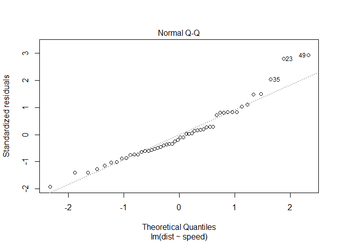

## Idenifying Residual Plot and Regression Model

As a datascientist we always have to work on data which may or may not be alwyays in support of the problem we are trying to solve. In regression anlysis while working on multiple models we have to focus on many datapoint and their imacts on the predictions. 
  One of such datapoint is Residual plots and how we can read it and correct or improve our regression model by visually undersatdning the Residual plots.

I am going to user Cars dataset from R, which has follwoing two fields:

+ speed	 numeric	 Speed (mph)
+ dist	 numeric	 Stopping distance (ft)

Summary of the data can be seen as below :


```r
summary(cars)
```

```
##      speed           dist       
##  Min.   : 4.0   Min.   :  2.00  
##  1st Qu.:12.0   1st Qu.: 26.00  
##  Median :15.0   Median : 36.00  
##  Mean   :15.4   Mean   : 42.98  
##  3rd Qu.:19.0   3rd Qu.: 56.00  
##  Max.   :25.0   Max.   :120.00
```

### Regression 
I am going to use speed of the car in mph to identify the stopping distance covered in ft. 

+ Predictor: Speed
+ response : Stopping Distance 
+ Model1 : Distance = intercept + slope * speed

Below Residuals vs Fitted plots shows how the residuals are seen close to the regression line . Points below the regression line have positive error and points above the regression line have negative error. 
Postive errors indicates points lies below the regression line and have predicted value greater than the actual vlaue. 
Negative Error indicates points lies above the regression line and have predicted value less than the actaul value.


```
## 
## Call:
## lm(formula = dist ~ speed, data = cars)
## 
## Residuals:
##     Min      1Q  Median      3Q     Max 
## -29.069  -9.525  -2.272   9.215  43.201 
## 
## Coefficients:
##             Estimate Std. Error t value Pr(>|t|)    
## (Intercept) -17.5791     6.7584  -2.601   0.0123 *  
## speed         3.9324     0.4155   9.464 1.49e-12 ***
## ---
## Signif. codes:  0 '***' 0.001 '**' 0.01 '*' 0.05 '.' 0.1 ' ' 1
## 
## Residual standard error: 15.38 on 48 degrees of freedom
## Multiple R-squared:  0.6511,	Adjusted R-squared:  0.6438 
## F-statistic: 89.57 on 1 and 48 DF,  p-value: 1.49e-12
```

<!-- --><!-- --><!-- --><!-- -->

Rsidual plots if it doens't show any pattern by looking at the data points (as shown in above plot) we can say that this model may be able to explain some of the varaiats of the data. This doen't suggest that its a best model but it suggest that its not a bad model. Since there is no visible pattern of the data that can be seen can say that model is on the right track.  


```r
coef(model1)
```

```
## (Intercept)       speed 
##  -17.579095    3.932409
```
# Shows at the speed of 0  your Stopping distance -17.57 ft  . 


```r
model2 <- lm(dist~I(speed-mean(speed)),cars)
coef(model2)
```

```
##            (Intercept) I(speed - mean(speed)) 
##              42.980000               3.932409
```


```r
mean(cars$speed) 
```

```
## [1] 15.4
```

# Shows at the speed of 15.4mph your Stopping distance  42.98  ft . 

Lets see how much it for a 10th of a mile speeds


```r
model3 <- lm(dist~I(speed*10),cars)
coef(model3)
```

```
##   (Intercept) I(speed * 10) 
##   -17.5790949     0.3932409
```


```r
sp <- c(4,7,8)
coef(model1)[1] + coef(model1)[2] * sp
```

```
## [1] -1.849460  9.947766 13.880175
```

```r
coef(model2)[1] + coef(model2)[2] * sp
```

```
## [1] 58.70964 70.50686 74.43927
```

```r
coef(model3)[1] + coef(model3)[2] * sp
```

```
## [1] -16.00613 -14.82641 -14.43317
```

```r
predict(model1,newdata = data.frame(speed=sp))
```

```
##         1         2         3 
## -1.849460  9.947766 13.880175
```

```r
summary(model1)
```

```
## 
## Call:
## lm(formula = dist ~ speed, data = cars)
## 
## Residuals:
##     Min      1Q  Median      3Q     Max 
## -29.069  -9.525  -2.272   9.215  43.201 
## 
## Coefficients:
##             Estimate Std. Error t value Pr(>|t|)    
## (Intercept) -17.5791     6.7584  -2.601   0.0123 *  
## speed         3.9324     0.4155   9.464 1.49e-12 ***
## ---
## Signif. codes:  0 '***' 0.001 '**' 0.01 '*' 0.05 '.' 0.1 ' ' 1
## 
## Residual standard error: 15.38 on 48 degrees of freedom
## Multiple R-squared:  0.6511,	Adjusted R-squared:  0.6438 
## F-statistic: 89.57 on 1 and 48 DF,  p-value: 1.49e-12
```

```r
summary(model2)
```

```
## 
## Call:
## lm(formula = dist ~ I(speed - mean(speed)), data = cars)
## 
## Residuals:
##     Min      1Q  Median      3Q     Max 
## -29.069  -9.525  -2.272   9.215  43.201 
## 
## Coefficients:
##                        Estimate Std. Error t value Pr(>|t|)    
## (Intercept)             42.9800     2.1750  19.761  < 2e-16 ***
## I(speed - mean(speed))   3.9324     0.4155   9.464 1.49e-12 ***
## ---
## Signif. codes:  0 '***' 0.001 '**' 0.01 '*' 0.05 '.' 0.1 ' ' 1
## 
## Residual standard error: 15.38 on 48 degrees of freedom
## Multiple R-squared:  0.6511,	Adjusted R-squared:  0.6438 
## F-statistic: 89.57 on 1 and 48 DF,  p-value: 1.49e-12
```

```r
summary(model3)
```

```
## 
## Call:
## lm(formula = dist ~ I(speed * 10), data = cars)
## 
## Residuals:
##     Min      1Q  Median      3Q     Max 
## -29.069  -9.525  -2.272   9.215  43.201 
## 
## Coefficients:
##                Estimate Std. Error t value Pr(>|t|)    
## (Intercept)   -17.57909    6.75844  -2.601   0.0123 *  
## I(speed * 10)   0.39324    0.04155   9.464 1.49e-12 ***
## ---
## Signif. codes:  0 '***' 0.001 '**' 0.01 '*' 0.05 '.' 0.1 ' ' 1
## 
## Residual standard error: 15.38 on 48 degrees of freedom
## Multiple R-squared:  0.6511,	Adjusted R-squared:  0.6438 
## F-statistic: 89.57 on 1 and 48 DF,  p-value: 1.49e-12
```


```r
par(mfrow = c(2, 2)) 
plot(model2)
```

<!-- -->


```r
par(mfrow = c(2, 2))  
plot(model1)
```

<!-- -->


```r
library(ggplot2)
```

```
## Warning: package 'ggplot2' was built under R version 3.5.3
```

```r
 g = ggplot(cars,aes(x = speed, y= dist)) 
 g = g + xlab("Speed")
 g = g + ylab("Distance")
 # g = g + geom_point(size = 7, color = "black" , alpha = .6)
 g = g + geom_point(size = 3, color = "blue" , alpha = .3)
 g = g + geom_smooth(method = "lm", color = "gray")
 g
```

<!-- -->

properties of REsidual E[e] = 0

```r
e <- resid(model1) 

# Residual = Observed value - Predicted value

yhat <- predict(model1) # predicted from Model

y <- cars$dist # Observed value 

calculated_Res <- y - yhat

# check if Calcaulted residual is equial to computed Residual 
# print(paste("Computed Residual-->:",round(e,2),"=",round(calculated_Ress,3),"<--Calculated Residual"))
dt_ress <- data.frame("Computed Residual"=e, "Calculated Residual"=calculated_Res)

dt_ress
```

```
##    Computed.Residual Calculated.Residual
## 1           3.849460            3.849460
## 2          11.849460           11.849460
## 3          -5.947766           -5.947766
## 4          12.052234           12.052234
## 5           2.119825            2.119825
## 6          -7.812584           -7.812584
## 7          -3.744993           -3.744993
## 8           4.255007            4.255007
## 9          12.255007           12.255007
## 10         -8.677401           -8.677401
## 11          2.322599            2.322599
## 12        -15.609810          -15.609810
## 13         -9.609810           -9.609810
## 14         -5.609810           -5.609810
## 15         -1.609810           -1.609810
## 16         -7.542219           -7.542219
## 17          0.457781            0.457781
## 18          0.457781            0.457781
## 19         12.457781           12.457781
## 20        -11.474628          -11.474628
## 21         -1.474628           -1.474628
## 22         22.525372           22.525372
## 23         42.525372           42.525372
## 24        -21.407036          -21.407036
## 25        -15.407036          -15.407036
## 26         12.592964           12.592964
## 27        -13.339445          -13.339445
## 28         -5.339445           -5.339445
## 29        -17.271854          -17.271854
## 30         -9.271854           -9.271854
## 31          0.728146            0.728146
## 32        -11.204263          -11.204263
## 33          2.795737            2.795737
## 34         22.795737           22.795737
## 35         30.795737           30.795737
## 36        -21.136672          -21.136672
## 37        -11.136672          -11.136672
## 38         10.863328           10.863328
## 39        -29.069080          -29.069080
## 40        -13.069080          -13.069080
## 41         -9.069080           -9.069080
## 42         -5.069080           -5.069080
## 43          2.930920            2.930920
## 44         -2.933898           -2.933898
## 45        -18.866307          -18.866307
## 46         -6.798715           -6.798715
## 47         15.201285           15.201285
## 48         16.201285           16.201285
## 49         43.201285           43.201285
## 50          4.268876            4.268876
```


```r
# Sum of residual must be zero 

 sum(dt_ress$Calculated.Residual)
```

```
## [1] -1.360689e-12
```
10^-12 is close to 0.


```r
# Sum of Residual multiplyied by Regression Variable  shoud be zero
sum(dt_ress$Calculated.Residual * cars$speed)
```

```
## [1] -1.685052e-11
```
10^-11 is close to 0.


```r
ggplot(cars, aes(x = speed, y = dist)) +
  geom_smooth(method = "lm", se = FALSE, color = "lightgrey") +
  geom_segment(aes(xend = speed, yend = yhat), alpha = .2) +

  # > Color adjustments made here...
  geom_point(aes(color = abs(e))) + # Color mapped to abs(residuals)
  scale_color_continuous(low = "black", high = "red") +  # Colors to use here
  guides(color = FALSE) +  # Color legend removed
  # <

  geom_point(aes(y = yhat), shape = 1) +
  theme_bw()
```

<!-- -->

```r
# same Plot but moving it in center so that we can clearly see residuals
ggplot(cars, aes(x = speed, y = e)) +
  geom_smooth(method = "lm", se = FALSE, color = "lightgrey") +
  geom_segment(aes(xend = speed, yend = 0), color ="red", alpha = .2) + 
  ylab("Residual Disatance in Ft") +

  # > Color adjustments made here...
  geom_point(aes(color = abs(e))) + # Color mapped to abs(residuals)
  scale_color_continuous(low = "black", high = "red") +  # Colors to use here
  guides(color = FALSE) +  # Color legend removed
  # <

  # geom_point(aes(y = yhat), shape = 1) +
  theme_bw()
```

<!-- -->

## Moving steps ahead 
Now we will genrate some data points that are randomaly gernated and noramlly distrbbuted. 

X <- Genrate 100 data points between 3 and -3 
y <-  x + sin(x) 
y1 <- x + sin(x) + rnorm(100,sd=.2)
y2 <-  x + rnorm(100,sd=.2)

My objective is to see how residual plots would come when we try to build llinear regression model lm(Y~X). Let's dive into it and see the power of residual plots visaullay. 

 You can see how y,y1,y2 are distributed , by histogram and scatterplot. 
 

```r
# Trying to see Residual with different data set that is not linear.

x <- runif(100,-3,3) # Genrate 100 data points between 3 and -3 

y <-  x + sin(x) 
y1 <- x + sin(x) + rnorm(100,sd=.2)
y2 <-  x + rnorm(100,sd=.2)
dt_chk <- data.frame('x'= x,'y'=y ,'y1'=y1, 'y2'=y2)
head(dt_chk )
```

```
##            x          y        y1         y2
## 1  1.9309903  2.8668188  3.352629  2.0231600
## 2  0.0890511  0.1779846  0.320571  0.4316150
## 3 -1.0534957 -1.9226530 -1.818391 -1.2771628
## 4  0.5725210  1.1142737  1.169030  0.6309607
## 5 -1.0802123 -1.9622702 -2.048347 -1.0824503
## 6  2.5016344  3.0987964  3.146961  2.8058144
```

```r
par(mfrow = c(3, 3)) 
hist(y)
hist(y1)
hist(y2)
plot(y)
plot(y1)
plot(y2)
```

<!-- -->

Now if we plot regression line and actual data points , and try to understand how good the model is, most of the time we may feel our model is good since datapoints are close to regression line. In  1st plot , it looks very clearly that our data is making a sine waves along with regression line, whereas in 2nd plot it looks very close that our model might be  good choice for this data. Third plot is also showing the same information. 


```r
 g = ggplot(dt_chk,aes(x = x, y= y)) 
 g = g + xlab("Speed") + ggtitle(" Value for Y ")
 g = g + ylab("Distance")
 # g = g + geom_point(size = 7, color = "black" , alpha = .6)
 g = g + geom_point( aes(x = x, y= y),size = 3, color = "blue" , alpha = .3)
 # g = g + geom_point( aes(x = x, y= y1),size = 2, color = "green" , alpha = .3)
 # g = g + geom_point( aes(x = x, y= y2),size = 1, color = "red" , alpha = .3)
 # g = g + geom_point(size = 3, color = "red" , alpha = .3))
 g = g + geom_smooth(method = "lm", color = "gray")
 g
```

<!-- -->

```r
 g = ggplot(dt_chk,aes(x = x, y= y)) 
 g = g + xlab("Speed") + ggtitle(" Value for Y1 ")
 g = g + ylab("Distance")
 # g = g + geom_point(size = 7, color = "black" , alpha = .6)
 # g = g + geom_point( aes(x = x, y= y),size = 3, color = "blue" , alpha = .3)
 g = g + geom_point( aes(x = x, y= y1),size = 2, color = "green" , alpha = .3)
 # g = g + geom_point( aes(x = x, y= y2),size = 1, color = "red" , alpha = .3)
 # g = g + geom_point(size = 3, color = "red" , alpha = .3))
 g = g + geom_smooth(method = "lm", color = "gray")
 g
```

<!-- -->

```r
 g = ggplot(dt_chk,aes(x = x, y= y)) 
 g = g + xlab("Speed") + ggtitle(" Value for Y2 ")
 g = g + ylab("Distance")
 # g = g + geom_point(size = 7, color = "black" , alpha = .6)
 # g = g + geom_point( aes(x = x, y= y),size = 3, color = "blue" , alpha = .3)
 # g = g + geom_point( aes(x = x, y= y1),size = 2, color = "green" , alpha = .3)
 g = g + geom_point( aes(x = x, y= y2),size = 1, color = "red" , alpha = .3)
 # g = g + geom_point(size = 3, color = "red" , alpha = .3))
 g = g + geom_smooth(method = "lm", color = "gray")
 g
```

<!-- -->


### How do we validate it now ?
Lets plot residual plot and see how does that looks for each y,y1,y2.

Figure 1: In contrast to last plot here we see that our residuals plots give very clear pattern which seems to follow a clear sine wave path in the residaul plot. Except third plot first two plots seems to follow sine wave and hence it's clear that we are missing some thing the regression model for these equations. We can try explaning these pattern in the model to improve our regression model.


```r
# lets build the model
model3 <- lm(y~x,dt_chk)
model4 <- lm(y1~x,dt_chk)
model5 <- lm(y2~x,dt_chk)
par(mfrow = c(2, 2)) 
plot(model3)
```

<!-- -->

```r
plot(model4)
```

<!-- -->

```r
plot(model5)
```

<!-- -->

This resach suggest how residual plots are imporant and how they can give us hidden inforaiton about the data and help us bnuild the model that better explain the response varaible .


```r
# Sum of residual must be zero 

 sum(resid(model3))
```

```
## [1] -2.692291e-15
```

```r
# Sum of Residual multiplyied by Regression Variable  shoud be zero
sum(resid(model3) * x)
```

```
## [1] 8.070801e-16
```

```r
# Sum of residual must be zero 

 sum(resid(model5))
```

```
## [1] 1.113692e-15
```

```r
# Sum of Residual multiplyied by Regression Variable  shoud be zero
sum(resid(model5) * x)
```

```
## [1] -1.879681e-15
```

